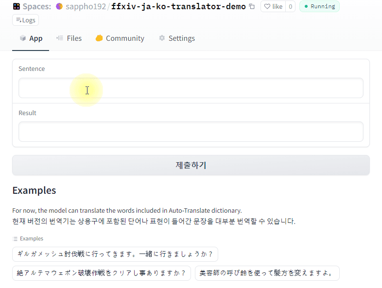
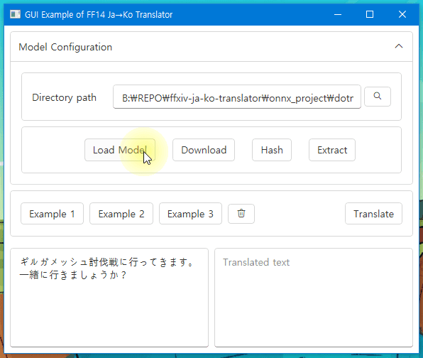

# ffxiv-ja-ko-translator

Japanese→Korean Translator specialized in Final Fantasy XIV

**FINAL FANTASY is a registered trademark of Square Enix Holdings Co., Ltd.**

[[Model Link (Huggingface)](https://huggingface.co/sappho192/ffxiv-ja-ko-translator)] [[Model Link (Github)](https://github.com/sappho192/ffxiv-ja-ko-translator/releases)]
[[Demo Link](https://huggingface.co/spaces/sappho192/ffxiv-ja-ko-translator-demo)]

## 1. Description

At the beginning, this project was created to solve the [[issue](https://github.com/sappho192/IronworksTranslator/issues/45)] in IronworksTranslator, which is to provide more accurate translation result in Final Fantasy XIV game chat.

Papago and DeepL can be a great choice in common situation, but not for the text in specific game. So I'm trying to make the alternative to help people who want to get better understand and communication in Japanese game.

## 1.1 Demo

### HuggingFace Space

You can try web demo in [[Here](https://huggingface.co/spaces/sappho192/ffxiv-ja-ko-translator-demo)]

[](https://huggingface.co/spaces/sappho192/ffxiv-ja-ko-translator-demo)

### ONNX on Windows

This is an example of Windows GUI app using ONNX-converted model and ONNXRuntime.
For more information, please visit [[Here](https://github.com/sappho192/ffxiv-ja-ko-translator/tree/main/onnx_project/dotnet)]

[](https://github.com/sappho192/ffxiv-ja-ko-translator/tree/main/onnx_project/dotnet)

[](https://github.com/sappho192/ffxiv-ja-ko-translator/tree/main/onnx_project/dotnet)

## 1.2 [Training report](https://api.wandb.ai/links/sappho192/zxtaf2kq "Wandb report page")


## 2. How to use

Before you run the code, make sure the required environments have installed.

Check [[requirements.txt](https://github.com/sappho192/ffxiv-ja-ko-translator/blob/main/requirements.txt)].  
You can use this file with PyPI(`pip install -r requirements.txt`)

### Inference (PyTorch)

```python
from transformers import(
    EncoderDecoderModel,
    PreTrainedTokenizerFast,
    BertJapaneseTokenizer,
)

import torch

encoder_model_name = "cl-tohoku/bert-base-japanese-v2"
decoder_model_name = "skt/kogpt2-base-v2"

src_tokenizer = BertJapaneseTokenizer.from_pretrained(encoder_model_name)
trg_tokenizer = PreTrainedTokenizerFast.from_pretrained(decoder_model_name)

# You should change following `./best_model` to the path of model **directory**
model = EncoderDecoderModel.from_pretrained("./best_model")

text = "ギルガメッシュ討伐戦"
# text = "ギルガメッシュ討伐戦に行ってきます。一緒に行きましょうか？"

def translate(text_src):
    embeddings = src_tokenizer(text_src, return_attention_mask=False, return_token_type_ids=False, return_tensors='pt')
    embeddings = {k: v for k, v in embeddings.items()}
    output = model.generate(**embeddings, max_length=500)[0, 1:-1]
    text_trg = trg_tokenizer.decode(output.cpu())
    return text_trg

print(translate(text))
```

## Inference (Optimum.OnnxRuntime)
Note that current Optimum.OnnxRuntime still requires PyTorch for backend. [[Issue](https://github.com/huggingface/optimum/issues/526)]
You can use either [[ONNX](https://huggingface.co/sappho192/ffxiv-ja-ko-translator/tree/main/onnx)] or [[quantized ONNX](https://huggingface.co/sappho192/ffxiv-ja-ko-translator/tree/main/onnxq)] model.

```Python
from transformers import BertJapaneseTokenizer,PreTrainedTokenizerFast
from optimum.onnxruntime import ORTModelForSeq2SeqLM
from onnxruntime import SessionOptions
import torch

encoder_model_name = "cl-tohoku/bert-base-japanese-v2"
decoder_model_name = "skt/kogpt2-base-v2"

src_tokenizer = BertJapaneseTokenizer.from_pretrained(encoder_model_name)
trg_tokenizer = PreTrainedTokenizerFast.from_pretrained(decoder_model_name)

sess_options = SessionOptions()
sess_options.log_severity_level = 3 # mute warnings including CleanUnusedInitializersAndNodeArgs
# change subfolder to "onnxq" if you want to use the quantized model
model = ORTModelForSeq2SeqLM.from_pretrained("sappho192/ffxiv-ja-ko-translator",
        sess_options=sess_options, subfolder="onnx") 

texts = [
    "逃げろ!",  # Should be "도망쳐!"
    "初めまして.",  # "반가워요"
    "よろしくお願いします.",  # "잘 부탁드립니다."
    "ギルガメッシュ討伐戦",  # "길가메쉬 토벌전"
    "ギルガメッシュ討伐戦に行ってきます。一緒に行きましょうか？",  # "길가메쉬 토벌전에 갑니다. 같이 가실래요?"
    "夜になりました",  # "밤이 되었습니다"
    "ご飯を食べましょう."  # "음, 이제 식사도 해볼까요"
 ]


def translate(text_src):
    embeddings = src_tokenizer(text_src, return_attention_mask=False, return_token_type_ids=False, return_tensors='pt')
    print(f'Src tokens: {embeddings.data["input_ids"]}')
    embeddings = {k: v for k, v in embeddings.items()}

    output = model.generate(**embeddings, max_length=500)[0, 1:-1]
    print(f'Trg tokens: {output}')
    text_trg = trg_tokenizer.decode(output.cpu())
    return text_trg


for text in texts:
    print(translate(text))
    print()
```


### Training

Check `training.ipynb` for the full example.

#### Datasets

Before you run the training code, be sure to check that the datasets are exists in designated path.

In `training.ipynb`, the code regarding dataset is in `Data` section like below:

```python
DATA_ROOT = './output'
# FILE_FFAC_FULL = 'ffac_full.csv'
# FILE_FFAC_TEST = 'ffac_test.csv'
FILE_JA_KO_TRAIN = 'ja_ko_train.csv'
FILE_JA_KO_TEST = 'ja_ko_test.csv'

# train_dataset = PairedDataset(src_tokenizer, trg_tokenizer, f'{DATA_ROOT}/{FILE_FFAC_FULL}')
# eval_dataset = PairedDataset(src_tokenizer, trg_tokenizer, f'{DATA_ROOT}/{FILE_FFAC_TEST}') 
train_dataset = PairedDataset(src_tokenizer, trg_tokenizer, f'{DATA_ROOT}/{FILE_JA_KO_TRAIN}')
eval_dataset = PairedDataset(src_tokenizer, trg_tokenizer, f'{DATA_ROOT}/{FILE_JA_KO_TEST}')   
```

Those `.csv` files contain two column data pair: the first column contains the sentence in Japanese language and the second column contains the sentence in Korean language.

Because of the spec of encoder and decoder model, **the length of each sentence should not exceed 512 characters.** I recommend you to remove the data rows if one of column data is more than 500 characters.

**You don't need to define the name of column at the first row.**

#### Telemetry

The training code uses `wandb` for the telemetry. Please make account in [[wandb.ai](https://wandb.ai/home)] if you don't have the account.

## 3. Limitations of this project

Since the main goal of this project is to help Koreans communicate in Japanese games, so I'm not considering other languages. However, I believe you can use the structure of this project to create your own translator for your own language combinations.

## 4. Goal of this project

### 1) Proof of Concept Phase 1

* [X] A. [A model trained on a small amount of game terms is able to correctly translate the same terms](https://github.com/sappho192/ffxiv-ja-ko-translator/issues/2)
* [X] B. [Somewhat translate sentences that contain some game terms](https://github.com/sappho192/ffxiv-ja-ko-translator/issues/3)

### 2) Proof of Concept Phase 2

* [ ] A. [Properly translate sentences that contain some game terms](https://github.com/sappho192/ffxiv-ja-ko-translator/issues/4)
* [ ] B. [Somewhat translate sentences that contain most of game terms](https://github.com/sappho192/ffxiv-ja-ko-translator/issues/5)

### 3) Beta Phase

* [ ] [Properly translate sentences that contain most of game terms](https://github.com/sappho192/ffxiv-ja-ko-translator/issues/6)

### 4) Future Phase

* [ ] [Train a model which can interactively help understanding the Japanese game chat (like a ChatGPT or Bing chatbot)](https://github.com/sappho192/ffxiv-ja-ko-translator/issues/7)

## 5. Indication of dataset sources

### Helsinki-NLP/tatoeba_mt

The translator model trained in this repository used `jpn-kor` [[sub-dataset](https://github.com/Helsinki-NLP/Tatoeba-Challenge/blob/master/data/README.md)] in [[Helsinki-NLP/tatoeba_mt](https://huggingface.co/datasets/Helsinki-NLP/tatoeba_mt)]. This dataset is shared under the [[CC BY-NC-SA 4.0](https://creativecommons.org/licenses/by-nc-sa/4.0/deed.ko)] licence [[Source](https://github.com/Helsinki-NLP/Tatoeba-Challenge/issues/29#issuecomment-1379929671)].

You can acquire the specific `jpn-kor` dataset from [[HuggingFace](https://huggingface.co/datasets/sappho192/Tatoeba-Challenge-jpn-kor)].

### In-game Auto-Translate sentences in FFXIV

`© SQUARE ENIX CO., LTD. All Rights Reserved.`

> The **auto-translator** is a feature in *[Final Fantasy XIV: A Realm Reborn](https://ffxiv.fandom.com/wiki/Final_Fantasy_XIV:_A_Realm_Reborn "Final Fantasy XIV: A Realm Reborn")* that auto-translates text into whatever language a player's client is set to.
>
> *From [[Final Fantasy XIV: A Realm Reborn Wiki](https://ffxiv.fandom.com/wiki/Auto-translator)] ([CC BY-SA 3.0](https://www.fandom.com/licensing))*

Since the Auto-Translate words and sentences contain essential terms mainly used in the game, I used this dataset as a primary source to accurately train the model.

According to the Materials Usage License ([[EN](https://support.na.square-enix.com/rule.php?id=5382&tag=authc)] [[JP](https://support.jp.square-enix.com/rule.php?id=5381&la=0&tag=authc)]) of Final Fantasy XIV, I can use `All art, text, logos, videos, screenshots, images, sounds, music and recordings from FFXIV` without `any sales or commercial use` and `license fees or advertising revenue`, but even so, I `must immediately comply with any request by Square Enix to remove any Materials, in Square Enix's sole discretion`.

Based on above condition, I have gathered Auto-Translate text ① I see in the game myself, ② referring fandom wiki page [[eLeMeN - FF14 - その他_定型文辞書](http://www5.plala.or.jp/SQR/ff14/etc/dictionary/)].

## 6. About releasing the dataset

As announced in [#9 Release the dataset](https://github.com/sappho192/ffxiv-ja-ko-translator/issues/9#issuecomment-1500211044), I've established own rules for this repository about sharing the dataset directly:

- **Never disseminate the part of dataset which is gathered by data-mining unless the Square Enix requested or permitted to do so**
- **If some part of dataset is gathered from the vaild source, don't share them in here directly but attach the link or guide to acquire the same data**

It is to fulfill the request of Naoki Yoshida announced in [Regarding Third-party Tools](https://na.finalfantasyxiv.com/lodestone/topics/detail/36c4d699763603fadd2e61482b0c5d56cb2e4547):

> ... **I've made this request before, and I make it again: please refrain from disseminating mined data.**

However I'm going to make up for guides to reproduce my training result as same as possible. And you can always ask a question via [Discussions](https://github.com/sappho192/ffxiv-ja-ko-translator/discussions) page.

## 7. Summary of license

This repository contains the library and data which has various license. If you meet a restriction, consider replacing that part into alternative.

### Model license

* [[KoGPT2](https://github.com/SKT-AI/KoGPT2?tab=License-1-ov-file#readme)](decoder): **[CC BY-NC-SA 4.0](https://creativecommons.org/licenses/by-nc-sa/4.0/deed.ko) (Creative Commons Attribution-NonCommercial-ShareAlike 4.0)**
* [[bert-japanese](https://github.com/cl-tohoku/bert-japanese)](encoder): Apache-2.0 License

### Dataset license

* [[Helsinki-NLP/tatoeba_mt](https://huggingface.co/datasets/Helsinki-NLP/tatoeba_mt)]: [**CC BY-NC-SA 4.0**](https://creativecommons.org/licenses/by-nc-sa/4.0/deed.ko)

### Libraries & others in the Onnx Project

* [[CySharp/csbindgen](https://github.com/Cysharp/csbindgen)]: MIT License
* [[sappho192/BertJapaneseTokenizer](https://github.com/sappho192/BertJapaneseTokenizer)]: MIT License
* [[unidic-mecab-2.1.2_bin](https://clrd.ninjal.ac.jp/unidic/en/back_number_en.html)]: BSD License
* [[microsoft/onnxruntime](https://github.com/Microsoft/onnxruntime)]: MIT License
* [[SciSharp/NumSharp](https://github.com/SciSharp/NumSharp)]: Apache-2.0 License
* [[MeCab.DotNet](https://github.com/kekyo/MeCab.DotNet)]: **GPL-2.0 or LGPL-2.1 License**
