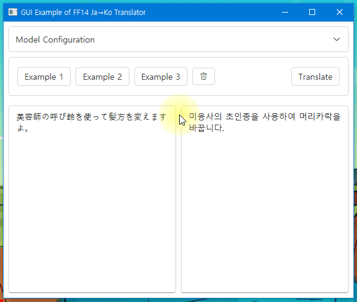

# Onnx Project

Onnx utilization code without PyTorch dependency

## Description

This repository has complete code which can run EncoderDecoder type translator model(ORTModelForSeq2SeqLM) without HuggingFace Optimum or PyTorch dependency.

Optimum provides ONNXRuntime-based inference but it currently depends on PyTorch [[Link](https://github.com/huggingface/optimum/issues/526)].

So I've implemented some required functions in C# or Rust to run my model without Python, which means anyone can run my translator in their own computer.

## Structure

This example project consists of three languages' folder: `.NET(C#)`,`Python`, and `Rust`.

### Python directory

First, `python` folder contains the minimal sets of code which runs the model in various way:

* `infer_torch.py`: Vanilla code that naively runs the model using transformers and PyTorch library.
* `infer_onnx.py`: Optimized code which runs the ONNX-converted model using Optimum.OnnxRuntime library.
  * Note that this Optimum.OnnxRuntime still has PyTorch dependency in current version. [[issue](https://github.com/huggingface/optimum/issues/526)]
* `exercise_onnx_greedy.py`:Completely optimized code which runs the ONNX model using OnnxRuntime, which doesn't have dependency on PyTorch.

### Rust directory

`rust` folder contains the rust library project which generates OS-native library(`.dll,.so,.dylib`), which provides the wrapper API of HuggingFace.Tokenizers library in Rust language. [[Tokenizers](https://github.com/huggingface/tokenizers)]

[[CySharp/csbindgen](https://github.com/Cysharp/csbindgen)] is used in this project to export the APIs into OS-native library.

After running `cargo build`, a C# class file `NativeMethods.cs` will be created, which can be used to call the library API. Check the `build.rs`.

### .NET directory

`dotnet` folder contains two projects:

* `infer_onnx`: PoC example that loads the ONNX model and performs the translation task.
* `GuiExample`: Complete GUI example which can independently downloads the model from the HuggingFace and performs the translation. See the following demo:

> ![NOTE]  
> The `BertJapaneseTokenizer.dll` library is directly compiled from [[sappho192/BertJapaneseTokenizer](https://github.com/sappho192/BertJapaneseTokenizer)],  
> which is the C# implementation of [[transformers.bert_japanese.BertJapaneseTokenizer](https://github.com/huggingface/transformers/blob/main/src/transformers/models/bert_japanese/tokenization_bert_japanese.py)].
